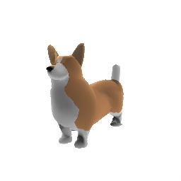
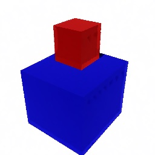

# 🧠 SceneGPT: Semantic & Generative 3D Scene Understanding

This project explores 3D semantic understanding of real-world indoor spaces using deep learning and generative AI. It combines classical geometric reconstruction with modern models like RandLA-Net and OpenAI's Point-E.
## Part 1:RandLA-Net(Object Detection)
|    |  |
| ------------------------------ | ---------------------------- |

## Part 2:Video To Point3D(RGB frames to Point)
 |    |  |
| ------------------------------ | ---------------------------- |

## Part 3:Point_e(Text_to_point,Image_to_point...etc)
 |    |  |
| ------------------------------ | ---------------------------- |
---

## 🎯 Features

- ✅ Convert video to RGB-D with MiDaS + COLMAP
- ✅ Reconstruct 3D mesh using Open3D TSDF fusion
- ✅ Segment 3D objects using RandLA-Net on S3DIS
- ✅ Generate point clouds using Point-E (text & image prompts)

---